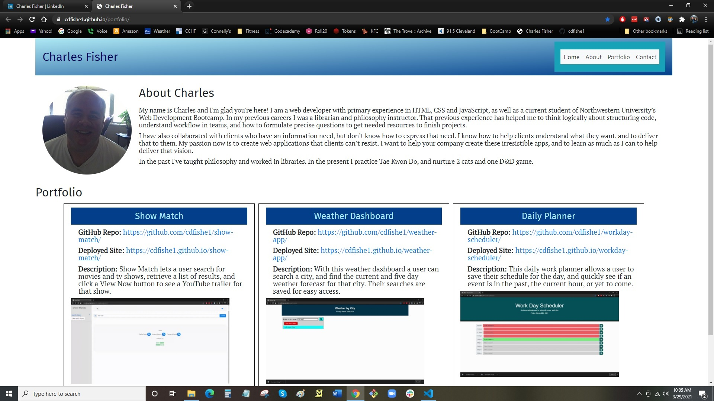

# Portfolio page for Charles Fisher

This is my professional portfolio page.

## Table of Contents
* [My Portfolio Page](#portfolio-landing-page)
* [Deployment](#deployment)
* [Scope of Project](#scope-of-project)
* [Installation](#installation)
* [Noted Resources](#noted-resources)
* [Testing](#testing)
* [Credits](#credits)
* [License](#license)

## Portfolio Landing Page

### Desktop and Tablet Page

### Mobile Page

## Deployment

Site deployed at [Charles Fisher](https://charlesfisher.dev/)

## Scope of Project

* Unique url address
* Used separate style sheets for reset and style to ease editing.
* Used flex grid and flex box for layout and responsiveness.
* Utilized gradients in backgrounds to enhance visual experience.
* Designed from the mobile experience first up to larger screen sizes.

## Installation

Deploy the html file and assets folder that contains the images and css files on a website host server.

## Noted Resources

I made particular use of the following resources:

* [Chris Coyer. "A Complete Guide to Flexbox](https://css-tricks.com/snippets/css/a-guide-to-flexbox/)
* [Chris House. "A Complete Guide to Grid"](https://css-tricks.com/snippets/css/complete-guide-grid/)
* [Coolors](https://coolors.co/)
* [Chris Coyer. "CSS Gradients"](https://css-tricks.com/css3-gradients/)

## Credits

* Radomir "Rad" Fugiel, bootcamp TA, for helping me think about CSS flex grid.
* David Metcalfe, bootcamp tutor, for helping me with media queries and thinking about mobile first design.

## License

Copyright (c) Charles Fisher All rights reserved. 
Please be kind and change content if you wish to use this code.

Licensed under the MIT License

Copyright (c) 2021 - present | Charles Fisher

<blockquote>
Permission is hereby granted, free of charge, to any person obtaining a copy
of this software and associated documentation files (the "Software"), to deal
in the Software without restriction, including without limitation the rights
to use, copy, modify, merge, publish, distribute, sublicense, and/or sell
copies of the Software, and to permit persons to whom the Software is
furnished to do so, subject to the following conditions:

The above copyright notice and this permission notice shall be included in all
copies or substantial portions of the Software.

THE SOFTWARE IS PROVIDED "AS IS", WITHOUT WARRANTY OF ANY KIND, EXPRESS OR
IMPLIED, INCLUDING BUT NOT LIMITED TO THE WARRANTIES OF MERCHANTABILITY,
FITNESS FOR A PARTICULAR PURPOSE AND NONINFRINGEMENT. IN NO EVENT SHALL THE
AUTHORS OR COPYRIGHT HOLDERS BE LIABLE FOR ANY CLAIM, DAMAGES OR OTHER
LIABILITY, WHETHER IN AN ACTION OF CONTRACT, TORT OR OTHERWISE, ARISING FROM,
OUT OF OR IN CONNECTION WITH THE SOFTWARE OR THE USE OR OTHER DEALINGS IN THE
SOFTWARE.
</blockquote>

